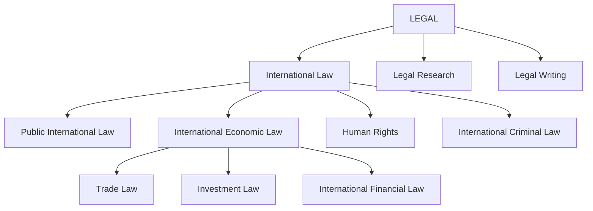

# ⚖️ Executive Law Command Center

### International Law · Economics · Finance · Languages · Strategic Learning

A multidisciplinary knowledge and learning system integrating **international law, international economics, finance, languages, and strategic professional development** into a single executive-level knowledge hub.

---

## 🎯 Professional Profile

### Multidisciplinary Expertise
International trade and financial law, international economics, corporate finance, MBA fundamentals, and multilingual communication across **English, Spanish, French, Korean, and Bahasa Malaysia**.

### 🌍 Digital-Nomad Professional
A location-independent professional who combines continuous learning, cross-disciplinary research, legal-economic analysis, and strategic consulting through an optimized personal knowledge management system.

### 💻 Digital Knowledge Ecosystem
Designed to work seamlessly across a **MacBook, 11-inch iPad, 13-inch iPad, and iPhone**, enabling research, writing, language learning, knowledge management, and professional work from anywhere.

---

# 📚 Knowledge Hub

## ⚖️ 1. International Law & International Economics

[[international-trade-law|International Trade Law]]

[[digital-financial-law|Digital Financial Law & Financial Innovation]]

[[international-economics|International Economics & Trade Policy]]

---

## 🌐 2. Polyglot Language Hub

[[english-c2|English — C2 Academic & Legal Precision]]

[[spanish-c2|Español — C2 Mastery]]

[[french-c2|Français — C2 Mastery]]

[[korean-c2|한국어 — C2 Precision]]

[[malay-c2|Bahasa Malaysia — C2 Competency]]

---

## 🎯 3. IELTS Band 9 Preparation

[[ielts-writing-task2|IELTS Writing Task 2 — Academic Writing & Structure]]

[[ielts-speaking|IELTS Speaking — Fluency & Coherence]]

---

## 📈 4. Finance & Investment

[[corporate-finance|Corporate Finance & MBA Fundamentals]]

[[investment-strategies|Investment Strategies & Digital Assets]]

---

## 🧠 5. Learn How to Learn

[[obsidian-pkm|Personal Knowledge Management with Obsidian]]

[[learning-framework|Advanced Learning Framework — Polyglot & Legal Expertise]]

---

## 🔬 Core Integration

**International Law**  
↓  
**International Economic Law**  
↓  
**Trade · Investment · Finance · Digital Economy**  
↓  
**Economics · Corporate Finance · Policy**  

# LEGAL

↓  
**Languages · Diplomacy · Cross-Border Communication**  
↓  
**Strategic Analysis & Professional Practice**

> **Objective:** Build deep, interconnected expertise rather than isolated knowledge.

# LEGAL

