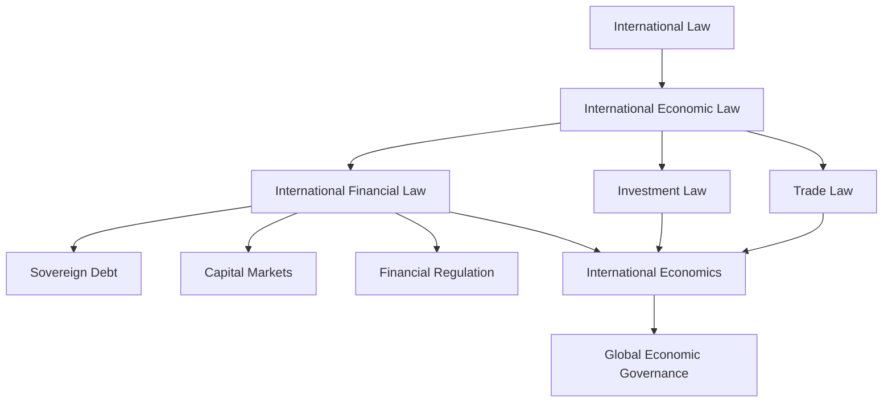

# ⚖️ THUNCHANOK LAW

### International Law · International Economic Law · Finance · Investment

A structured legal knowledge system for studying, researching, and analysing the legal frameworks governing cross-border economic activity.

---

## 🎯 Executive Law Command Center

The central hub for building advanced expertise in **international law and international economic law**, with particular emphasis on the interaction between law, finance, investment, trade, and global economic governance.

---

## 📚 Knowledge Hub

### 1. Public International Law

[[public-international-law|Public International Law]]

Foundations of the international legal order, including sources of international law, jurisdiction, state responsibility, treaties, immunities, and dispute settlement.

---

### 2. International Economic Law

[[international-economic-law|International Economic Law]]

The legal architecture governing international economic relations.

- [[international-trade-law|International Trade Law]]
- [[international-investment-law|International Investment Law]]
- [[international-financial-law|International Financial Law]]
- [[international-economic-governance|International Economic Governance]]

---

### 3. International Financial Law

[[international-financial-law|International Financial Law]]

Legal frameworks surrounding cross-border finance, sovereign debt, capital markets, financial regulation, and international monetary relations.

---

### 4. International Investment Law

[[international-investment-law|International Investment Law]]

Treaty-based investment protection, investor–State dispute settlement, expropriation, fair and equitable treatment, and regulatory authority.

---

### 5. International Trade Law

[[international-trade-law|International Trade Law]]

WTO law, regional trade agreements, trade remedies, market access, and the relationship between trade regulation and domestic policy.

---

## 🔬 Research & Analysis

[[legal-research|Legal Research]]

[[legal-writing|Legal Writing]]

[[case-law|Case Law & Dispute Settlement]]

[[treaties|Treaties & International Instruments]]

[[research-questions|Research Questions]]

---

## 🌏 Law · Finance · Economics

---

## 🎓 Academic & Professional Development

[[llm-preparation|LL.M. Preparation]]

[[scholarship|Scholarship & Academic Applications]]

[[diplomacy|Diplomacy & International Affairs]]

[[current-affairs|International Affairs & Current Issues]]

---

## 🧭 Core Research Direction

**How can international legal and economic frameworks facilitate effective cross-border integration while accommodating differences in regulatory capacity, institutional development, and domestic policy priorities?**

> **Objective:** Build narrow and deep expertise at the intersection of **international law, international economic law, finance, and global economic governance**.

*Global trade routes and the interconnected architecture of international commerce, finance, and investment.*

